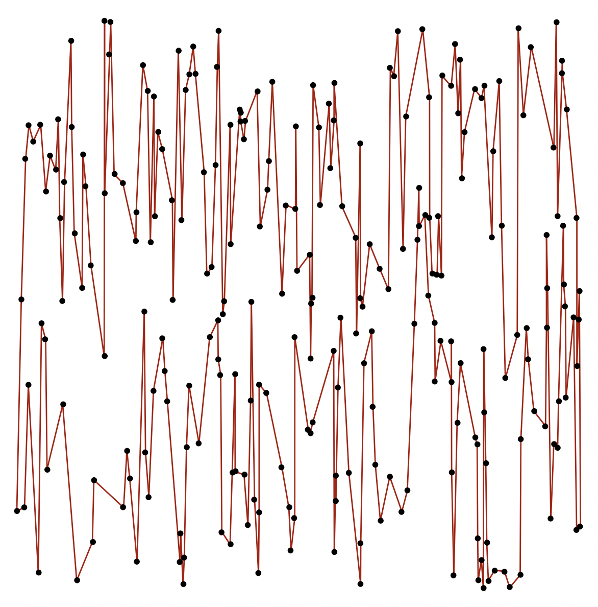

# BitonicTSP

This repository contains a bitonic TSP algorithm in C with a Python binding. There is some mitigable overhead in the Python binding, but this repo is primarily intended as a speed-up over a pure Python implementation (such as that in [TSP-vs-Graphs](https://github.com/samvanderpoel/TSP-vs-Graphs)). This code was tested on MacOS.

To set up the shared library, run
```
gcc -shared -o bitolib.so -fPIC bitonic.c
```

A typical execution of the algorithm is provided with
```
python main.py
```

<p align="center">
  
</p>
